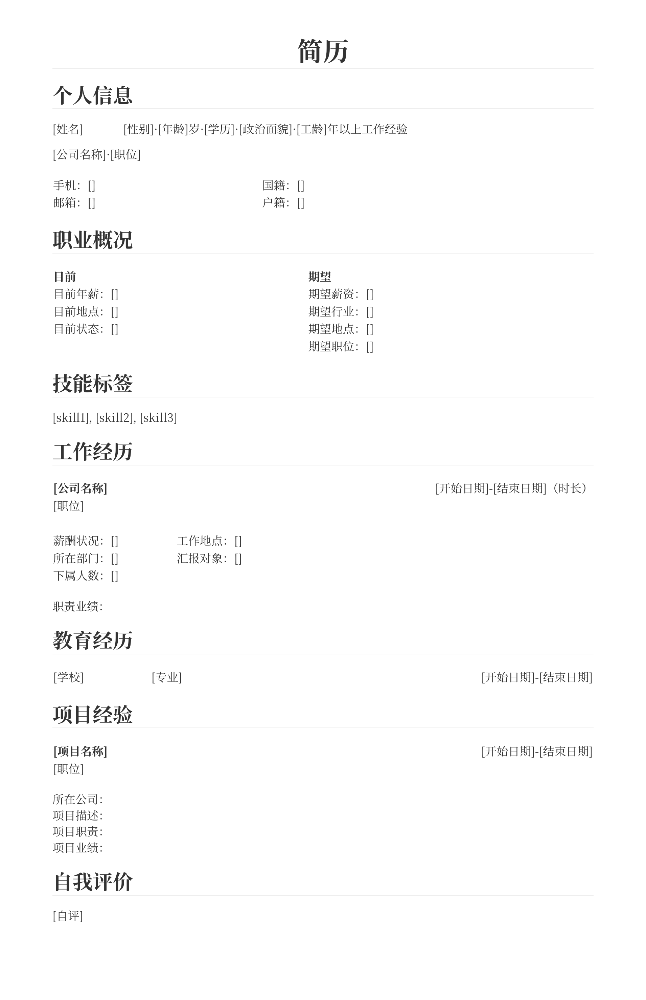

# markdown-resume
基于markdown的简历模板，并提供配套的主题样式。

## 预览

## 文件说明

- resume.css

    专门针对简历定制的 Typora 主题样式。fork from `typora/github.css`

- resume.md

    简历模板。

    可在此基础上填写自己的简历内容。

## 使用步骤

1. 将 resume.css 拷贝到 Typora 的主题目录下。
2. 重新打开 Typora，并切换主题至 Resume。
3. 拷贝 resume.md 至新文件。
4. 使用 Typora 打开该新文件。
5. 编辑简历。
6. 导出为 pdf。

## 设计说明

1. 表格的奇数列被设置为不能换行、宽度适配内容，方便排版。
2. 为确保同一类表格的列尽量对齐，部分列使用`&#12288;`(全角空格)进行了填充，注意不要删除。
3. 表格有虚线边框不必担心，是为了在编辑状态下方便对齐，导出后会自动消失。
4. `日期`格式建议使用`年.月`，如`2023.10`。
