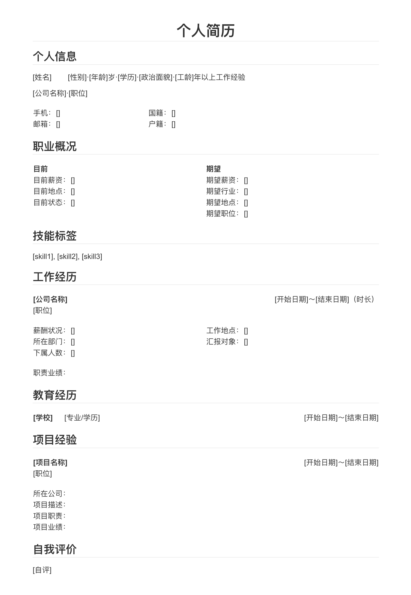

# markdown-resume
基于markdown的简历模板，并提供配套的主题样式

## 预览

## 文件说明

- resume.css

    专门针对简历定制的主题样式。fork from `typora/github.css`

    依赖字体：

    - 普通字体：[思源宋体](https://github.com/adobe-fonts/source-han-serif)
    - 等宽字体：[Go Mono](https://github.com/golang/image/tree/master/font/gofont/ttfs)

- resume.md

    简历模板。

    可在此基础上填写自己的简历内容。

## 使用说明

1. 将 resume.css 拷贝到 Typora 的主题目录下。
2. 重新打开 Typora，并切换主题至 Resume。
3. 拷贝 resume.md 至新文件。
4. 使用 Typora 打开该新文件。
5. 编辑简历。
6. 导出为 pdf。

## 注意

1. 表格有虚线边框不必担心，是为了在编辑状态下方便对齐，导出后会自动消失。
